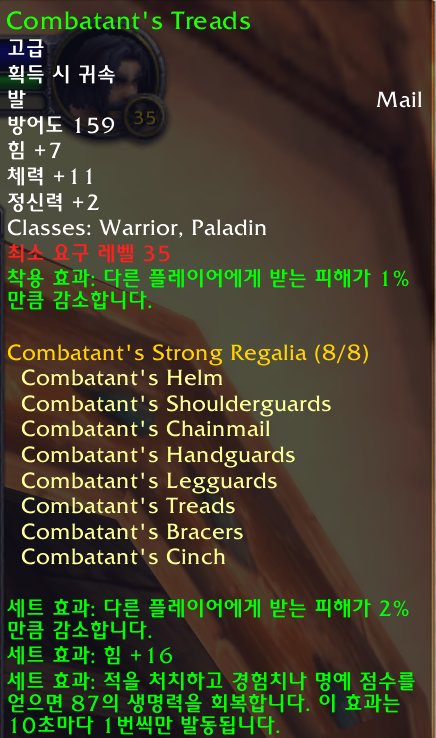
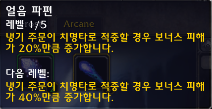
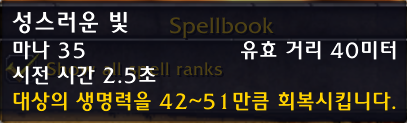
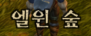
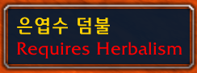
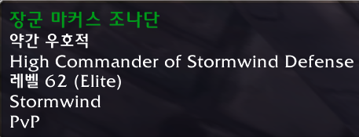
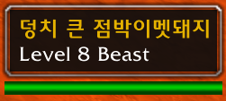
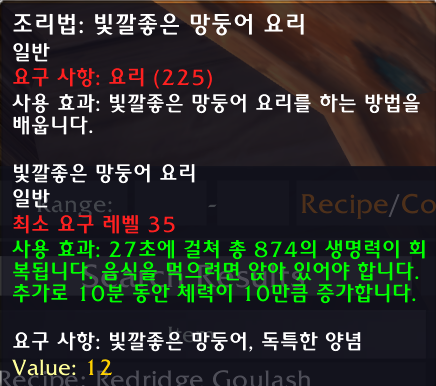
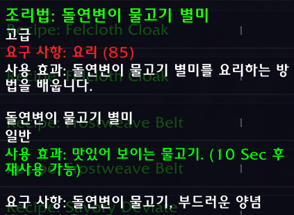

# 와우 3.3.5 영어 클라이언트 툴팁 한글화

와우 3.3.5 영어 클라이언트에서 

- 툴팁을 한글로 볼 수 있게 해주는 애드온.
- 유저가 직접 한글로 번역할 수 있게 해줌
- **<u>*유저가 번역한 내용을 툴팁에서 한글 구현 가능*</u>**.
- ***<u>100% AI를 이용한 번역 방법을 채택함</u>***.

### 목적

1. 와우 클라이언트의 데이터를 수정하는 엄청난 노가다를 하지 않고 툴팁의 내용은 한글로 보기 위해 만듬.
2. 영어 이름을 한글로 교체하는 방식으로 전문기술의 재료도 모두 한글로 보기 위함.
3. 모든 내용을 한글로 보기 위함이 아닌, 게임에 필요한 필수 내용을 한글로 보고 싶었기 때문.

### 기본 전제 및 제한

1. 기본 데이터(data 폴더)는 3.3.5 클라이언트에서 사용하는 데이터를 추출.
2. custom 폴더에 유저의 번역 데이터를 추가한다.
3. 툴팁이 아닌 프레임에 박혀 있는 글자는 한글화를 못함.

### 한글화 범위

1. 아이템 이름
   
   - data/item_data.lua 데이터 이용.
   
   - 툴팁의 첫번째 줄을 타겟으로 먼저 진행.
   
   - 전문기술 관련된 아이템 이름은 요구 사항, 재료, 도구에 반응.

2. 마법 이름
   
   - data/spell_name_data.lua 데이터 이용.
   
   - custom/spell_name_custom_data.lua는 유저가 추가할 수 있는 데이터 파일
   
   - 아이템 이름보다 마법 이름이 우선.
   
   - 마법 이름으로 한글을 교체 한 경우, 아이템 이름은 다음 단계로 건너뜀.

3. 오라 이름
   
   - 마법 이름과 동일한 데이터 이용 (data/spell_name_data.lua)
   
   - 유닛 프레임에서 노란색 글자에 반응.

4. 마법 설명
   
   - data/spell_desc_data.lua 는 기본 데이터
   
   - custom/spell_desc_custom_data.lua는 유저가 추가 할 수 있는 데이터 파일
   
   - 기본적으로 툴팁의 노란색 글자는 모두 마법이라는 가정으로 진행.
   
   - 즉 모든 노란색 글자는 한글화 가능 대상.
   
   - 하지만 노란색 글자가 한줄 -> 다음에 흰색 글자 한줄 -> 다음에 노란색 글자 한줄 나오면 한글 번역 대상 아님.

5. 아이템 효과 설명
   
   - 마법 설명과 동일한 데이터 파일을 읽음(data/spell_desc_data.lua,custom/spell_desc_custom_data.lua)
   
   - 세트효과, 착용 효과, 발동 효과, 사용효과가 붙어 있는 내용.
   
   - 글자 색깔 구분 없음.
   
   - <u>마법 부여는 구현 안되어 있음.</u>

6. 오라 설명
   
   - data/spell_aura_data.lua 데이터 이용.
   
   - 유닛의 버프/디버프를 한글화 할 수 있음

### 유저 데이터 추가 과정

1. **<u>추가 대상은 마법 설명, 오라 설명, 아이템 옵션 설명만 가능.</u>**

2. 먼저 번역을 원하는 대상을 파일로 남긴다.

3. 그리고 구글 Gemini 3 pro(**flash보다 반드시 pro에서 진행 할 것**)에서 저장된 파일과, spell_name_data.lua 파일을 추가.

4. 와우 용어로 번역해 달라고 말하면 끝. 

### 유저 데이터 추가 방법

1. 파일로 남기기
   
   - ******<u>한글을 추가하기 위해, 파일로 남기기를 원한다면, TooltipKOR-wotlk를 제외한 모든 애드온을 disable 하세요.</u>******
   
   - 마법 설명을 위한 옵션, 채팅창에 /sp_desc on/off 
   
   - 오라 설명을 위한 옵션, 채팅창에 / aura_dest on/off
   
   - 아이템 효과 설명을 위한 옵션, 채팅창에 /item_dest on/off 
   
   - 기본 옵션은 모두 off로 되어 있으며, 게임중에 언제라도 파일로 남길 수 있다.

2. 번역을 원하는 대상을 채팅창에 타이핑 (예시 마법 설명: /sp_desc on )

3. 각종 마법에 툴팁이 모두 나타날 때 까지 마우스 오버. 
   번역을 원하는 모든 마법(마법책, 특성, 행동단축바 가능)을 한번씩 마우스 오버를 해 툴팁을 띄운다.

4. 모두 툴팁을 봤다면, 채팅창에 타이핑 (예시 마법 설명: /sp_desc off)

5. 그리고 /reload 를 해준다.

6. 저장되는 위치는 와우가 설치된 폴더에서 WTF/Account/<계정>/SavedVariables/TooltipKOR-wotlk.lua 

7. 이후 TooltipKOR-wotlk.lua, spell_name_data.lua 파일을 Gemini 3 pro에 추가하여 번역해 달라고 요청 (Gemini 3 pro 무료로 충분히 가능)

8. 번역 완료된 내용을 TooltipKOR-wotlk/custom/spell_desc_custom_data.lua 파일을 열어서 추가한다.

9. **<u>추가할 때 주의사항은 lua 양식에 맞아야 되며, 미리 작성된 내용을 확인하면 쉽게 이해가능하며, 한 문장의 끝에 반드시 쉼표(,)를 붙인다. 쉼표 없으면 아래 번역들은 한글 출력이 안되며, 찾기가 굉장히 어려우니 본인만의 추가 방법을 만드는 것을 추천한다.</u>** 

### 애드온으로 구현된 것

1. 와우 3.3.5에서 사용하는 모든 아이템 및 마법 이름은 툴팁에서 한글로 구현됨. **<u>(단, 서버에서 아이템 이름이나 마법 이름/설명을 변경한 경우 영어로 표시)</u>**

     
     
   
   
   
2. 기본적인 지역 이름은 화면 중앙, 미니맵 상단, 지도에서의 지역 이름은 한글로 구현됨.

    

3. "스톰윈드 회계사무소", "평온초" 와 같은 오브젝트 툴팁은 모두 한글로 구현됨.

   

4. 3.3.5에서 사용한 모든 NPC(몹 포함)의 이름은 모두 한글로 구현됨.

    

5. 일부 메세지,채팅용어, 팝업 창은 한글로 구현됨.

6. Atlas, Aux-addon 툴팁의 내용을 한글로 볼 수있게 구현함.

7. 3.3.5에서 구현된 버프, 디버프 표시/사라지는 내용이 화면에 한글로 표시됨.
   
   

9. 경매장을 위해 아이템 이름, 마법 이름에 대해서 /검색 으로 영어로 출력 가능.<u>(띄어쓰기 무시하지만 이름을 정확히 입력)</u>

    예시)  
    
   /검색 리넨옷감 -> Linen Cloth  
   /검색 정의의문장 -> Seal of Righteousness

10. 전문직업의 아이템 항목들 모두 한글화

    
